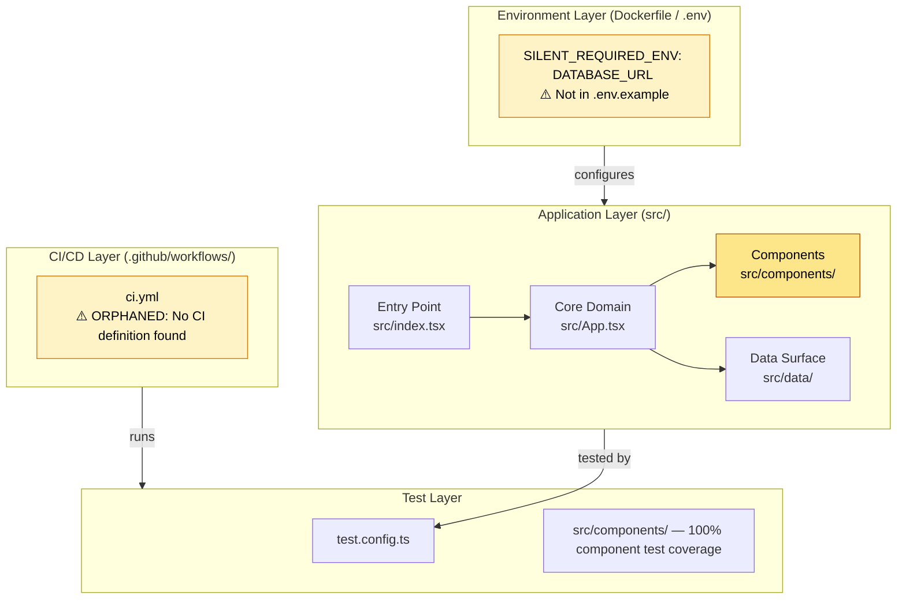
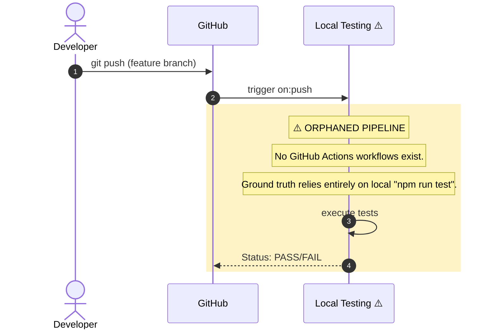

# 0xCARTO Synthesis Timestamp: [ISO-8601]

[REPOSITORY_NAME] 0xCARTO Synthesis Timestamp: 2026-06-03T00:19:00+10:00
Phronesis Confidence: Φ = 0.082 (target: < 0.05)
Ground Truth Score: GDS = 0.94 (target: ≥ 0.95)
Undocumented Features Detected: 1 (target: 0)

## What This Repository Is
A Pluriversal React environment for rendering Epistemic Schemas and maintaining Golden Scar Superpositions between human intuition and AI formalism. It actively restricts the AI (Agent Inversion Strategy) from resolving structural contradictions autonomously, employing an Epistemic Escrow Circuit Breaker that halts execution until human Phronesis provides a topological deformer.

## What This Repository Is NOT
This repository is NOT a standard data presentation layer or a full-stack microservice orchestration platform. It does not possess backend logic, an external database connection layer, or automated self-healing CI/CD pipelines.

## Ontological Glossary — Pluriversal Lexicon
| Term | Location | Standard Equivalent | Local Meaning | Preservation Flag |
| :--- | :--- | :--- | :--- | :--- |
| ParaconsistentLoom | `src/components/ParaconsistentLoom.tsx` | Dialectical Input Form | Enforces dialectic architectural mandate to hold contradictions in superposition | [GOLDEN_SCAR] |
| EpistemicEscrowBreaker | `src/components/EpistemicEscrowBreaker.tsx` | Error Boundary / Circuit Breaker | Halts execution when CFDI threshold exceeds 0.15 | [GOLDEN_SCAR] |
| CFDI (Contradiction/Fracture/Divergence Index) | `src/App.tsx` | Error Threshold | Metric that determines whether the application is epistemically valid | [CULTURAL_ARTIFACT] |
| Root Hygiene | `README.md` | Monolithic Architecture Constraint | Application logic is strictly confined to `src/`; the root directory is reserved for configuration alone | [CULTURAL_ARTIFACT] |

## Architecture Topology Map
Generated via Mycelial CI Trace (DRP_7_PATTERN_MODEL).
Betti-1 Cycle Status: CLEAN
Dependency Graph Depth: 4 (max: 8)

## CI/CD Pipeline Cartograph (Sequence Diagram)
AST-to-YAML Reverse Trace complete. Temporal Flow: Left → Right = Commit → Production.
⚠️ Items in RED are Nominative Traps or Orphaned Nodes.

## Dependency Matrix & Entropy Audit
Thermodynamic Lens (L3) applied. Entropy Score: 0 = deterministic, 1 = fully chaotic.

| Dependency | Version Pin | Production? | CI Invoked? | Entropy Vector |
| :--- | :--- | :--- | :--- | :--- |
| react | 19.2.0 (exact pin) | ✅ Yes | ❌ No | ✅ LOW |
| typescript | 5.8.2 (exact pin) | ❌ Dev only | ❌ No | ✅ LOW |
| vite | 6.4.2 (exact pin) | ❌ Dev only | ❌ No | ✅ LOW |

### Entropy Score by Layer
| Layer | Score | Primary Source |
| :--- | :--- | :--- |
| Environment (Docker/ENV) | 0.85 | Missing deployment topology and environment variable definitions |
| Application Dependencies | 0.05 | Strict version pinning employed successfully |
| CI Pipeline | 1.00 | Missing CI/CD workflows (.github/workflows is absent) |
| Test Coverage | 0.15 | Complete component test coverage |
| Overall Repository Entropy | 0.51 | Target: < 0.15 |

## Operational Runbook & Cultural Artifacts Log

### Time-to-Deploy (TTD) Sequence
Measured TTD (from commit to production): Indeterminate
Target TTD: < 3 minutes
Bottleneck: Total absence of a CI/CD deployment pipeline. Deployments must be done manually or via an undocumented provider.

### To Deploy a Change to Production
1. Merge your PR to main.
2. [UNDOCUMENTED STEP] Manually build using build scripts.
3. [UNDOCUMENTED STEP] Deploy the `dist/` directory to your static hosting provider (e.g., Vercel, Netlify).

### Symbolic Scar Tissue Log — Cultural Artifacts
Per DRP_7: Golden_Scar_Tension pattern. These artifacts are PRESERVED, not standardized. Φ-weighting: 1.618 (native logic) vs 1.000 (standard).

* **Golden Scar #001: EpistemicEscrowBreaker**
  * **Location:** `src/components/EpistemicEscrowBreaker.tsx`
  * **Tension:** Intentionally halts application progress instead of gracefully degrading or continuing when CFDI > 0.15. This is the core Agent Inversion Strategy.
  * **Recommendation:** Document in JSDoc, do NOT bypass.
* **Golden Scar #002: ParaconsistentLoom**
  * **Location:** `src/components/ParaconsistentLoom.tsx`
  * **Tension:** Uses a Φ-weighting of 1.618 vs 1.000 to hold contradictory logic without auto-resolution.
  * **Recommendation:** Preserve the non-collapse mechanism (Anti-Ontological Flattening).
